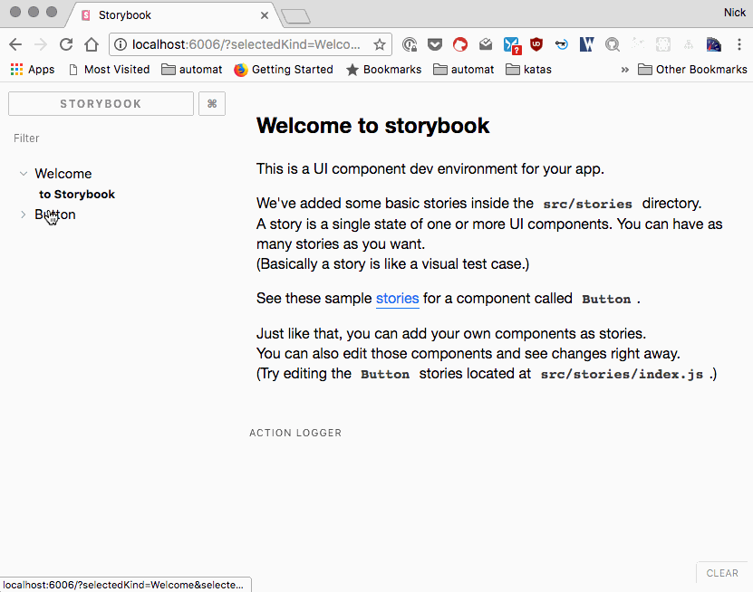

## Story what?

Storybook is a great tool for developing and showcasing components. I love it so much, I did a [talk about it](https://story.iamdeveloper.com) at [js-montreal](http://js-montreal.org) last summer. Storybook forces you, a good thing, to develop your components as components because you're not in the actual application. It supports [React](https://storybook.js.org/basics/guide-react), React Native, [Vue](https://storybook.js.org/basics/guide-vue) and [Angular](https://storybook.js.org/basics/guide-angular).

## Get Storybook installed and running in your project

We’ll assume you already have a React project created.

1. If you have `npx` installed, run `npx @storybook/cli`. For more info about `npx`, check out [Introducing npx: an npm package runner – Kat Marchán – Medium](https://medium.com/@maybekatz/introducing-npx-an-npm-package-runner-55f7d4bd282b). If you don’t have `npx` installed, you’ll need to install the CLI globally via `npm install @storybook/cli -g`.
2. Ensure you’re in the root of your front-end project.
3. From the command line, run. `getstorybook`. Because you have React installed as a dependency, getstorybook will know to install the necessary packages for Storybook for React as dev dependencies.

```json
    "@storybook/addon-actions": "3.3.15",
    "@storybook/addon-links": "3.3.15",
    "@storybook/addons": "3.3.15",
    "@storybook/react": "3.3.15",
```

4. If you look in your `package.json` file, you’ll have two new scripts.

```javascript
    "storybook": "start-storybook -p 6006",
    "build-storybook": "build-storybook"
```

5. From the command line, run `npm run storybook`.
6. Navigate to `http://localhost:6006` (or whichever port Storybook gives you in the `storybook` npm script.
7. Boom! You're in Storybook land. Go pat yourself on the back.



8.  The other script, `build-storybook`, if run, will generate a static Storybook site that you can deploy to wherever you like. By default, it will be generated into a folder called `storybook-static`.

## Anatomy of a Story

Now that you've got Storybook running in your project, you probably took a look at the out of the box stories that ship with it.

Let's break down what's going on in one of the sample stories.

```javascript
// We need the storiesOf function to write our stories.
import { storiesOf } from '@storybook/react';

// A function that allows you to simulate an action.
import { action } from '@storybook/addon-actions';

// The React component that we want to use in our Storybook stories.
import { Button } from '@storybook/react/demo';

// Here Button is the component name that you will see in the collapsible component tree
// in the Storybook application.
storiesOf('Button', module)
  // A first story to show what the button looks like with text.
  // Notice the  simulated action as well.
  .add('with text', () => (
    <Button onClick={action('clicked')}>Hello Button</Button>
  ))

  // A second story to show what the button looks like with emojis.
  .add('with some emoji', () => (
    <Button onClick={action('clicked')}>😀 😎 👍 💯</Button>
  ));
```

That's pretty much all there is to writing stories. It's really easy to use and such a great tool. In my next post, we’ll dig into some of the cool features of Storybook.

## References

- [Storybook](https://storybook.js.org), loads of great documentation here.
- A [great example from airbnb](http://airbnb.io/react-dates) of Storybook.
- Slides from my talk I did last year, [story.iamdeveloper.com](http://story.iamdeveloper.com)
